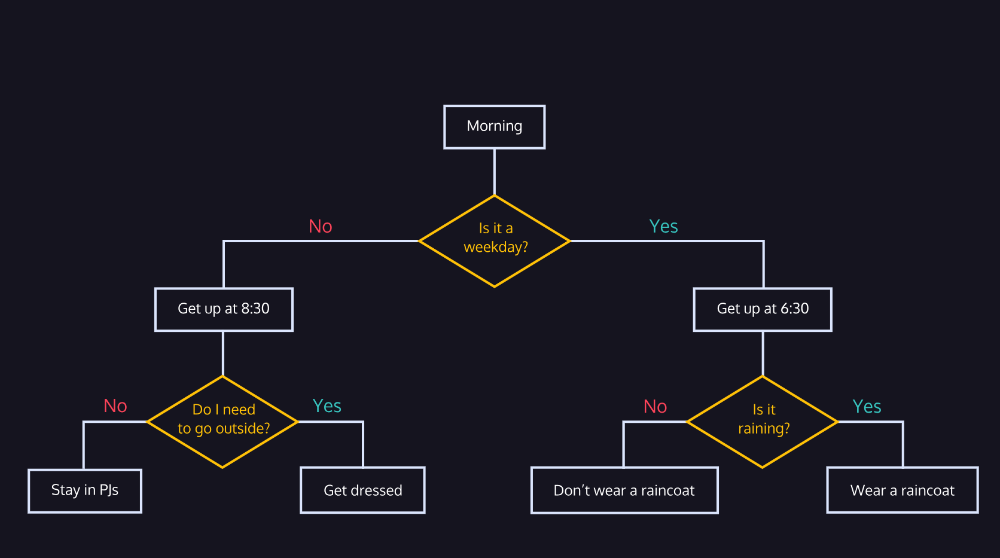

# Python-Study-Notes

**Gro.**

**Today's Topics**

* Learning Python 3 (Control FLow)

We know what flow control is. This should be a review and for you to hammer down how these loops and statements work in Python. Boolean statements are either true or false and they're verifiable. 

Relational operators - compare two values and returns `True` or `False`. So you have the equals operator `==` which will return `True` if both values are the same. Otherwise, `False`. The not equals operator `!=` will return `True` if the values are not equal to each other. Because that's a true statement. 

`True` and `False` are a special variable type called bool. Also, you can use the `type()` syntax to get the type of value for you input such as string, float, integer, bool, etc. 

Our `if` statements are in the format of

if <statement>:
  <action>

Where `if` kicks off the conditional statement and `:` is the "then". Say this every time you write these statements.

Okay remember we have more relational operators. We have `>`, `>=`, `<`, and `<=`. 

Now we have Boolean operators: `and`, `or`, and `not`. Lets start with the first one. The `and` will combine two Boolean expressions and resolve to `True` if both Boolean expressions are true. The `or` will evaluate as `True` as long as one of the expressions is true. If they are both `False`, then it will return `False`. Lastly, the `not` operator reverses the boolean value. So I would evaluate the expression first and whatever that expression is (True or False), take the opposite of that. 

Remember, if an `if` statement is `False`, it won't run. 

Switch-case statements and match-case statements are the same thing. But think of them as a cleaner way to write if-else statements with a bunch of elifs. Here's the syntax below:

match expression:  
    case value_1:  
        # code to execute when expression equals value_1  
    case value_2:  
        # code to execute when expression equals value_2  
    case value_3:  
        # code to execute when expression equals value_3  
    case value_4:  
        # code to execute when expression equals value_4  
    case value_N:  
        # code to execute when expression equals value_N  
    case default:  
        # code to execute when expression isn't equal to any of the values 

Only one case block is executed in the entire match block for any given value of expression. Once a case block is executed, the program’s control flow moves out of the match block.

You can use the `input()` syntax to prompt a user to give you an value for a variable. For example, `likes_snakes = input("Do you like snakes? ")` will ask the user Do you like snakes? And whatever the user responds as will be the input value for the variable `likes_snakes`. I'm not sure if the `input()` syntax stores everything as a string or not. I'll have to check. 

Project 3 - Magic 8-Ball

We created a script that would generate random answers like a Magic 8-Ball. We first had to import the `random` package for Python in order to use the `random.randint()` command. We used this to generate a number from 1 - 9 for each of the random answers the 8-Ball would give for the user's yes or no question. I used a match case statement for all 9 answer choices. I put the script in this repo. I would like to tailor the script to actually ask the user their name and question but I don't think these projects have an IDE. They just run the script. 

__________________________
Project 1 - Block Letters

We basically created our first and last initials using ASCII art in block letters. It was pretty straight forward. I used a triple quotation to just put in my initials with a 5 x 7 chart. I'll paste the code here for reuse later. 

Project 2 - Receipts for Lovely Loveseats

This lab was easier than the first lab lol. They gave us all the instructions but really we just set description and price values for 3 different items in a furniture shop. I personally chose to use the `+=` operator to add the number and string values up on two separate variables. We also had a sales tax which we added to the customer's total. Then we printed everything out. So nothing crazy. A copy of the code will be in my repo. 

## 01.07.2025

**Today's Topics**

* Learning Python 3 

Two common errors that we encounter while writing Python are SyntaxError and NameError.

SyntaxError means there is something wrong with the way your program is written — punctuation that does not belong, a command where it is not expected, or a missing parenthesis can all trigger a SyntaxError.

A NameError occurs when the Python interpreter sees a word it does not recognize. Code that contains something that looks like a variable but was never defined will throw a NameError.

A way to print out a string and then the value of your variable is to do `print("Here's my variable value ->", <variable-name>`. 

Python converts all ints to floats before performing division

You represent exponents by doing two asterisks. So 2 to the 4th power or 2^4 would be `2 ** 4` in Python. 

You can also use `%` to divide in Python but it will give you the remainder of the division operation. So `38 % 6` would yield `2` because 6 goes into 36 6 times and what's left over is 2. 

I created an if-else loop for this problem. Might of been overkill but I'm not exactly sure what they were looking for. 

String concatenation - combining two strings together. Use `str(#)` to make a number a string. Just insert your number or variable that is an integer. 

You can use the `=+` operator to update a currently existing value. You can also use this to add additional string values to a variable. I could see this being useful. 

You can create multi-line strings by using the triple `'` or `"` quotation marks. So you would have a variable and on the other side of the equal sign, put """ and then press enter. Paste your multi-line variable here and press enter again. Then, ende it with """ again. When you print the variable, it will print your paragraph. 
